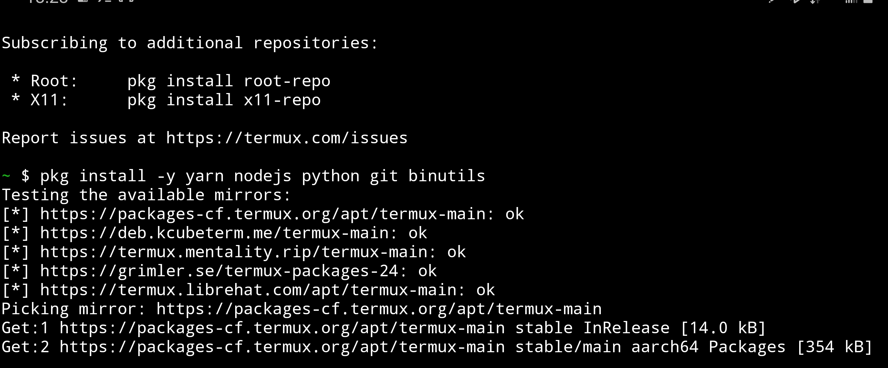

Was curious about getting VSCode running on my Samsung Note 9. I have a wireless bluetooth keyboard, so why not.

The process was pretty simple in the end, just needed to figure out a few parts first.

# Install steps
Came down to effectively 2 commands (3 if manually checking the installed node version like I am here):

```bash
$ pkg install -y yarn nodejs python git binutils
$ node -v
v17.4.0
$ FORCE_NODE_VERSION=17.4.0 yarn global add code-server --ignore-engines
```

The `--ignore-engines` flag may not have been needed in the end, I'm still a little unclear as to exactly what all it does.

Either way here's some shots of the install progress on my phone, `pkg` and `yarn` installs together probably took about 10-15 minutes, perhaps less:




Once installed it's time to fire up the VSCode server:

```bash
$ code-server &
```
It will start and then notify you about a config.yaml file that you'll need to open for a password when connecting to the server:


Now opening a browser and navigating to the supplied uri (localhost on 8080 in this case):


At this point crack open that config file and snag the password:


Logging in should show the good old welcome screen:


Hello world in python:


# Links
Some of the links visited during this, solution largely ended up being a combination of several of these:
* https://www.reddit.com/r/termux/comments/qs718m/vs_code_run_vs_code_on_termuxdesktop/
* https://dev.to/codeledger/how-to-get-visual-studio-code-to-run-in-termux-on-android-405j
* https://www.codewithharry.com/blogpost/install-vs-code-in-android
* https://gist.github.com/ppoffice/b9e88c9fd1daf882bc0e7f31221dda01
* https://github.com/coder/code-server/issues/4422
* https://github.com/coder/code-server/discussions/4748
* https://coder.com/docs/code-server/latest/termux#install
* https://www.reddit.com/r/termux/comments/i6fgpp/how_to_install_multiple_node_versions/
  - This one lead to quite a while spent on figuring out NVM before falling back to the method that actually worked.