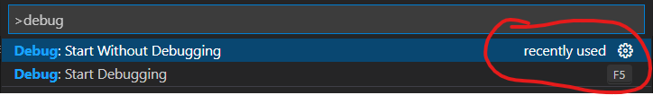
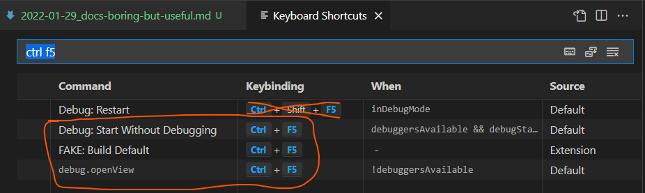
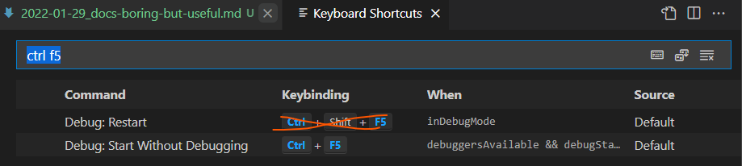
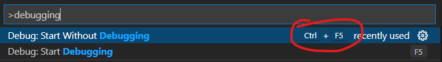

Doing some [advent of code](https://adventofcode.com) this morning and decided to figure out what settings in my [launch.json](https://github.com/trite/advent-of-code/blob/master/.vscode/launch.json) would let me simply run the code, rather than debug it.

# Solution
The same configuration is used for both modes, it is simply a different launch command:

Notice how there's no keybind listed for `Start Without Debugging`? But it defaults to `CTRL+F5` in VSCode, similar to other tools like Visual Studio!

## Keybinding issue
So what's wrong? The command palette can be a convenient way to check which command is going to fire for a keybind in the current context.

If the keybinding isn't showing up in the command palette then checking the keybindings seems like a reasonable first troubleshooting step.

And sure enough it is! The keybinding is used in several different contexts, and in my case the Fake (F# make tool) extension was attempting to execute even on Python when hitting `CTRL+F5`.

I do not currently use the other 2 contexts bound to `CTRL+F5` and removed them thusly.

Things look good now in the command palette and work as expected!

# So why mention docs?
Well this blog is here to help others if possible, but also to help myself! It took longer than ideal to figure this out, and for whatever reason my search skills were apparently lacking this morning. Going to the docs a little sooner would've been ideal in this case, and that is worth keeping in mind for the future!

The answer is here, though at the time of writing this it lists an older version of the command: `Debug: Run (Start Without Debugging)`:

https://code.visualstudio.com/docs/editor/debugging#_run-mode