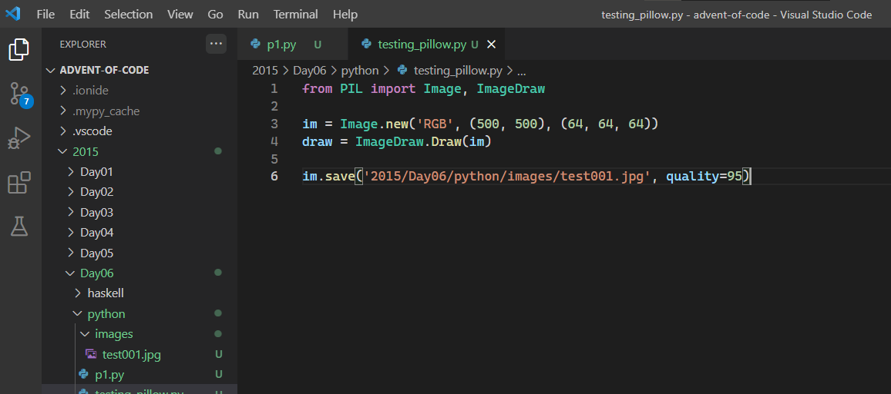
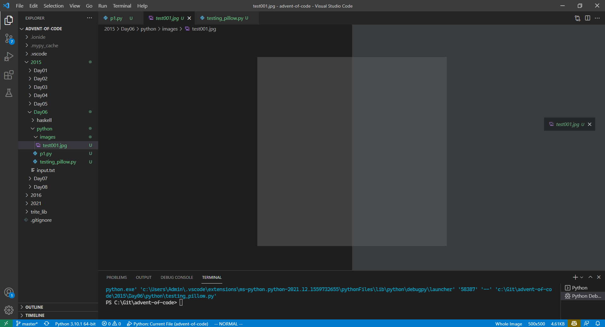
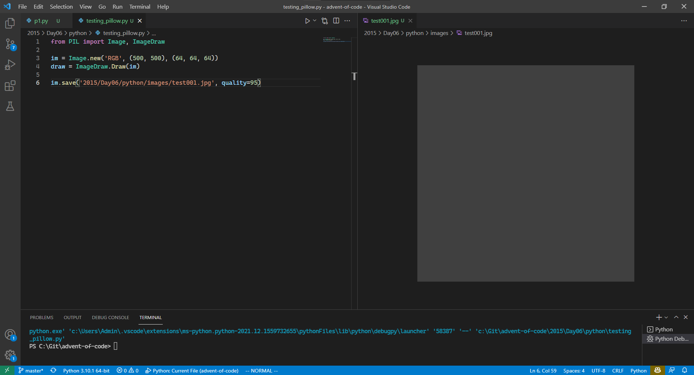
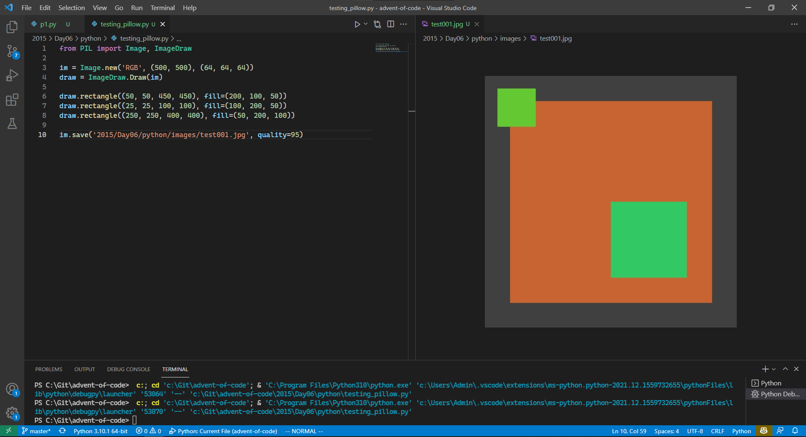
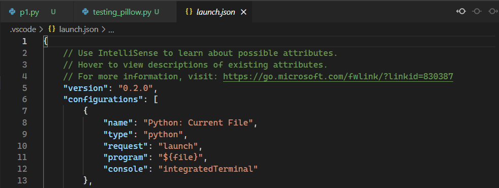
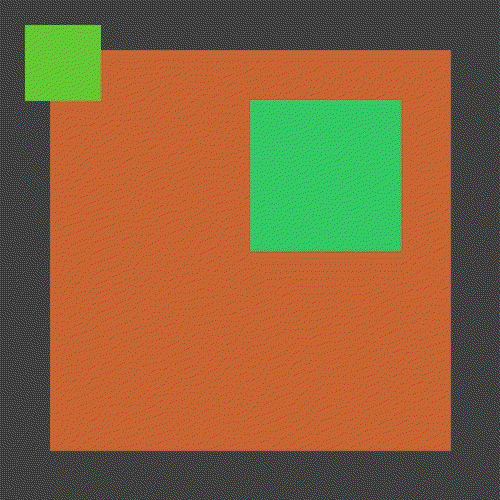

Working on [Advent of Code 2015 day 6 part 1](https://adventofcode.com/2015/day/6) in Python. This is a revisit to the problem for me. As such it presents the opportunity to easily add something neat (to me) for the sake of learning.

Taking a stab at using [Pillow](https://pillow.readthedocs.io/en/stable/) to draw at least the final frame of the problem, and ideally an animation of the entire process.

Figuring out a nice workflow to quickly test code changes is **vital** to any kind of rapid prototyping work. Setting up a good one in VSCode turned out to be pretty simple.

# Chosen solution
Run some image creation code
```python
from PIL import Image, ImageDraw

im = Image.new('RGB', (500, 500), (64, 64, 64))
draw = ImageDraw.Draw(im)

im.save('test.jpg', quality=95)
```


Open the image and then either drag it by its tab to the side or use hotkeys to split your view (default: `CTRL+\`).



Initial view after splitting:



Now all you should have to do is F5 after adding some lines to see the updated picture. By overwriting the same file each time and having VSCode watch that file you get live updates for free.



In the event that F5/CTRL+F5 do not work for you make sure to check that you have an appropriate [launch.json](https://code.visualstudio.com/docs/editor/debugging) file:



# Some simple fun
The final plan is to have an animation of each command being run. This is a good chance to make sure things work right first and goof around some.

The first animation test of course had a nice bug to fix, and allowed me to confirm that updating the animation updates the viewed image as well!

```python
import glob
from PIL import Image, ImageDraw

def test_image(offset: int, name: str) -> None:
    im = Image.new('RGB', (500, 500), (64, 64, 64))
    draw = ImageDraw.Draw(im)

    draw.rectangle((50, 50, 450, 450), fill=(200, 100, 50))
    draw.rectangle((25, 25, 100, 100), fill=(100, 200, 50))
    draw.rectangle((250, 100 + offset, 400, 250 + offset), fill=(50, 200, 100))

    im.save(name, quality=95)

imgPath = '2015/Day06/python/images'
imgPrefix = 'test_animation'

for o, i in zip(range(0, 250, 10), range(10000)):
    test_image(o, f'{imgPath}/{imgPrefix}{i}.jpg')

inputImgs = f'{imgPath}/{imgPrefix}*.jpg'
img, *imgs = [Image.open(f) for f in sorted(glob.glob(inputImgs))]

img.save(
    fp = f'{imgPath}/{imgPrefix}.gif',
    format = 'GIF',
    append_images = imgs,
    save_all = True,
    duration = 250, # frame duration in ms
    loop = 0
)
```

This will cause the animation frames to load in the wrong order:



Simply updating the filename to include leading zeroes for the image number will ensure the sorting we want in this case:

```python
for o, i in zip(range(0, 250, 10), range(10000)):
    test_image(o, f'{imgPath}/{imgPrefix}{i:03d}.jpg')
#           ensure number is 3 digits long ^^^^
```

And it's looking good now:

