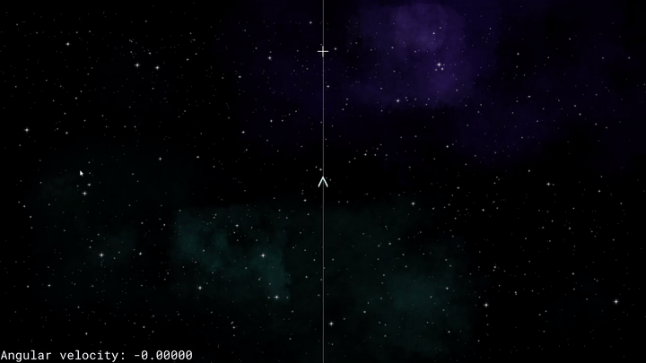
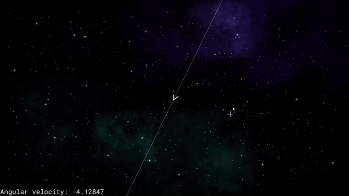

Been having fun with [Godot](https://godotengine.org/) the last week while on vacation. The original plan was to examine different ideas inspired by [Nova Drift (ND)](https://novadrift.io/). That has since changed to having fun with some art after a few realizations. Starting with something I *thought* I disliked about the game: the way the ship rotates.

# Soft turns
Without knowing proper terminology for the behavior this is difficult to try to demonstrate, time for some pictures/videos! First up is the original turn method I tried:



The ship immediately begins rotating at a decent rate, then slows down as it gets closer to pointing at its destination.



In order to obtain the best rate of rotation you need to act as though you're going to rotate past the destination to get the best performance out of your ship. In the context of a video game where bullets come out of the front of your ship and need to aim at your target this is counter-intuitive to gameplay.

So how does Nova Drift act for comparison?


Without debug info to provide hard numbers this is guessing, but the ship appears to rotate at a mostly constant rate. It might be slowing slightly as it approaches the target, or it might just look that way to my eyes.

Not sure if I'm going to want any slowing near the end of the turn, but having a constant turn rate for most of it needs to be an option.

## Why are you like this?
First up, rotation is tied into the Player's `_integrate_forces` function since it needs to make changes to the physics state:

```gdscript
func _integrate_forces(state):
    angular_velocity = smooth_rotate_toward(transform, global_position, targetPosition, old_turn_speed, delta)

func smooth_rotate_toward(localTransform, currentPosition, targetPosition, turnTime, delta):
	var targetDirection = targetPosition - currentPosition
	var angleToTarget = localTransform.x.angle_to(targetDirection)

	return (angleToTarget / turnTime) * delta
```

Most behavior is being left out in order to focus on the specifics: 

    angleToTarget / turnTime

The point of the `smooth_rotate_toward` function is to provide a float representing the angular velocity we want the ship to rotate with. Since this is being calculated as the remaining angle to turn divided by a flat value the ship never quite faces the target perfectly. It will constantly get closer by [ever smaller amounts](https://en.wikipedia.org/wiki/Logarithm) instead. That will be fine for some use cases, just not what I want right now.

# Fast turns
The goal or is to give the ship a max turn rate - a maximum radians/sec at which it can rotate. The ship should turn at this maximum rate unless doing so would overshoot the target. In other words the ship should generally attempt to turn at its max rate right up until it faces its target.

There are 3 states that potentially matter:
 * Need to rotate at or above the max rotation rate (far from target)
 * Need to rotate below the max rotation rate (nearing target)
 * Do not need to rotate (at target)

Still figuring things out, but for now settling on this implementation:

```gdscript
class_name PlayerRotation

const delta_mult = 60
const angle_delta_mult = 600

func angle_to_target(localTransform, currentPosition, targetPosition):
	var targetDirection = targetPosition - currentPosition
	return localTransform.x.angle_to(targetDirection)

func smooth_rotate_toward(localTransform, currentPosition, targetPosition, turnTime, delta):
	var angleToTarget = angle_to_target(localTransform, currentPosition, targetPosition)

	return (angleToTarget / turnTime) * delta * delta_mult

func fast_rotate_toward(localTransform, currentPosition, targetPosition, maxTurnRate, delta):
	var angleToTarget = angle_to_target(localTransform, currentPosition, targetPosition)

	return sign(angleToTarget) * min(delta * maxTurnRate, abs(angleToTarget * angle_delta_mult * delta))
```

The main part of interest being:

    sign(angleToTarget) * min(delta * maxTurnRate, abs(angleToTarget * angle_delta_mult * delta))

Breakdown:
 * `sign(angleToTarget)` - Direction of the turn is controlled by whether a number is positive or negative. The calculations that are about to be performed only account for magnitude though, so they will always be positive. This preserves that sign by providing a positive or negative 1 to multiply the rest of the result against.
 * `delta * maxTurnRate` - A flat amount to attempt to turn, multipled by delta to account for frame rate changes.
 * `abs(angleToTarget * angle_delta_mult * delta)` - Remaining angle to turn multiplied by delta and a flat multiplier value. Still not the best approach, but it gets close enough to the right behavior for now.
 * `min(...)` - Since both possible turn rates calculated so far are positive the appropriate one is simply the smaller value.

It's not perfect - ideally we should just return `delta * maxTurnRate` unless that would point past the target. This is something I'm going to keep revisiting though.

# Current state
Experimenting with different modifications to drawing like colors and opacity as well as ways to alter the ship's path like planetary gravity.
A few examples from recent testing:


