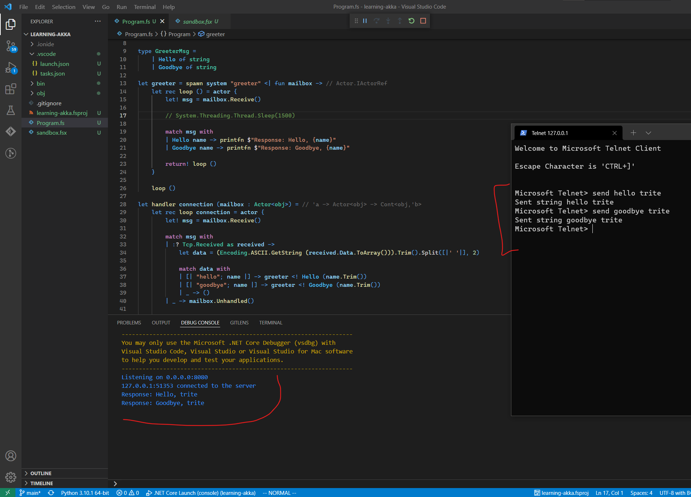

It's been a few years since I've had to use telnet, and even then it was always the same action: manually sending emails for troubleshooting purposes.

Working on familiarizing myself with [Akka.net](https://getakka.net/) by following along an [interesting series of blog posts](https://www.seventeencups.net/posts/building-a-mud-with-f-sharp-and-akka-net-part-one/) at seventeencups.net. Using telnet is necessary for a few of the early parts, but I found myself struggling with getting it to work properly.

# Steps
Pretty simple set of steps in this case:
 * telnet to the host: `telnet 127.0.0.1 8080`
 * escape from the default entry method: `CTRL+]`
 * use the `send` command: `send hello trite`

Like so:
