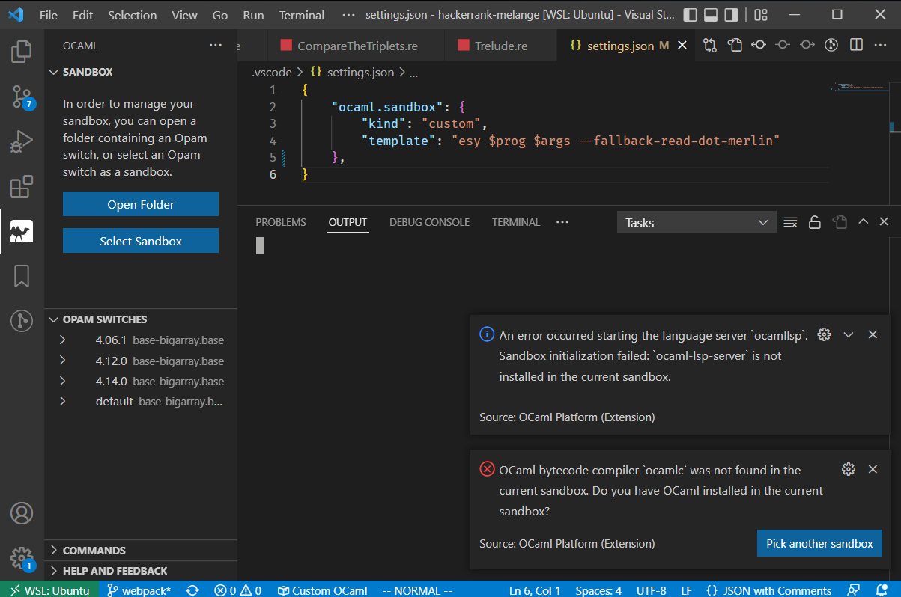
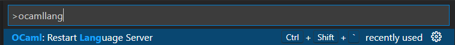
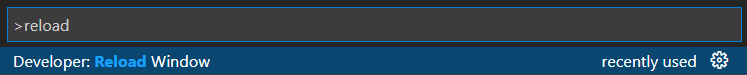

Look at this poor mistreated instance of VSCode as it tries it's best to start the OCaml LSP with the wrong settings. Does your VSCode instance look like this? You're in luck (unless you're not), read on!



# 1. Double check your LSP version
At the time of writing this (2022-06-10) the OCaml LSP requires use of a specific version to correctly work with Melange. This should change soon.

@mayhewluke on the ReasonML discord provided a nice explanation:

> Dune 3.0 provides an RPC server for language services to get the Merlin info from instead of writing to actual `.merlin` files, so `ocaml-lsp 1.9.0` removed support for reading `.merlin` in favor of talking to Dune directly. Melange has to use `.merlin` for various reasons, so we used to pin LSP to `1.8.3`, but `1.8.3` doesn't work with `ocaml 4.14`, so when `melange` updated to `4.14` language support broke.
> 
> @anmonteiro whipped up the `--fallback...` flag a few weeks ago, I think, but we don't yet have a release with it. A release has been requested, and apparently might land some time next week.
> https://discord.com/channels/436568060288172042/946816636197929080/984506621382250527 <== previous discussion on the topic

[Link to the original comment](https://discord.com/channels/235176658175262720/825155604641218580/984837516194635786) <== You may need to have joined the ReasonML discord for the link to work. [Link to the ReasonML Discord](https://discord.gg/reasonml)

Check that you have the following in your `devDependencies` in `esy.json`:
```json
    "@opam/ocaml-lsp-server": "ocaml/ocaml-lsp:ocaml-lsp-server.opam#c275140",
    "@opam/dot-merlin-reader": "4.2",
```

# 2. Check how you are launching the LSP in your editor
Launching an app via `esy` allows it to run in the context of the appropriate [sandbox environment](https://esy.sh/docs/en/concepts.html#project-sandbox). The goal is to get your editor of choice to launch the OCaml LSP with the following command:

```sh
esy ocamllsp --version --fallback-read-dot-merlin
```

## a. VSCode
Save the following in `./vscode/settings.json` from your project's root directory:

```json
{
    "ocaml.sandbox": {
        "kind": "custom",
        "template": "esy $prog $args --fallback-read-dot-merlin"
    }
}
```

Now either restart the OCaml language server or reload VSCode entirely. See either example below, which use VSCode's [command palette](https://code.visualstudio.com/docs/getstarted/userinterface#_command-palette) feature:


https://code.visualstudio.com/docs/getstarted/tips-and-tricks#_command-palette

### VSCode - Restart OCaml language server


I highly recommend adding a keybind to this command if you end up using it a lot.

### VSCode - Reload VSCode


Sometimes VSCode needs a bit more of a nudge. If restarting the language server doesn't seem to have done what it probalby should, you can always try this next.

**IMPORTANT:** If you restart VSCode and get a warning along the lines of `The OCaml Language Server crashed 5 times in the last 3 minutes. It will not be restarted` you need to **run the OCaml language server restart AGAIN AFTER running the VSCode reload**. Couldn't force my VSCode to give this error again so that wording is not exact and I have no screenshot of it :-(.

## b. Other editors
I'm not sure on these, but if anyone wants to send me steps in a comment or pull request I'd be happy to add them here!
